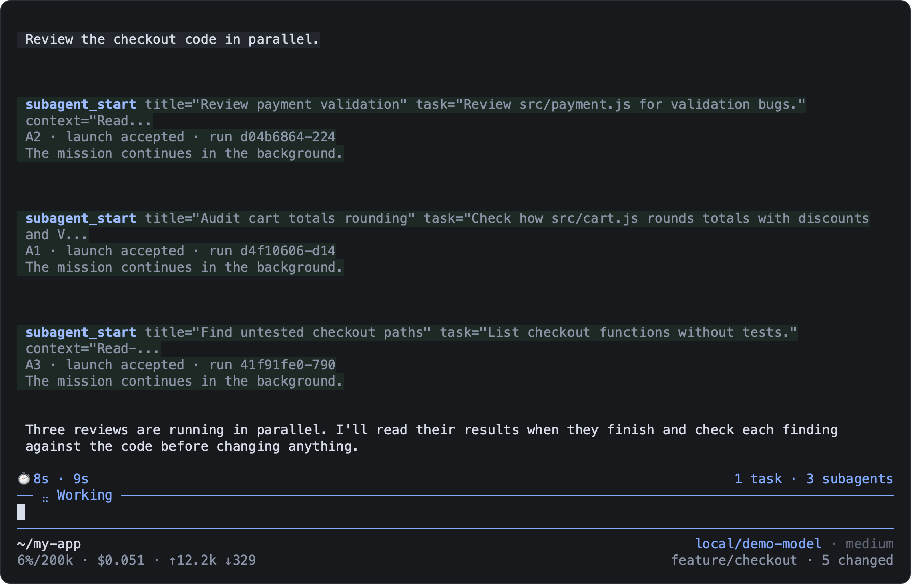

# pi-extensions

Extensions for the [Pi coding agent](https://pi.dev). They let the agent delegate work to
subagents, run shell commands in the background, ask you questions, search and read the web,
check a web UI in a real browser, navigate TypeScript code and compact its context at a good
moment. A dark theme with run timers and a denser footer completes the set.

Each extension is its own npm package: install only the ones you want. They work alone and
complement each other when loaded together. Apart from subagents, which runs child sessions
with the models you choose, none of them calls a second model or depends on your AI provider.



## Extensions

| Extension | What it does | Needs |
| --- | --- | --- |
| [subagents](packages/subagents/README.md) | Delegates missions to child Pi sessions working in parallel; `/subagents` follows them live | macOS or Linux with procps `ps`; extra model calls |
| [background-tasks](packages/background-tasks/README.md) | Runs non-interactive shell commands in the background, tracked by ID; `/ps` shows them with live logs | macOS or Linux with procps `ps` |
| [ask-user](packages/ask-user/README.md) | Lets the agent ask you questions: single or multiple choice, free text, and a summary before sending | Interactive terminal |
| [web](packages/web/README.md) | Brave web search, page reading as Markdown, and versioned library docs from Context7 | Brave and/or Context7 API key for search and docs |
| [ui-check](packages/ui-check/README.md) | Headless Chromium the agent opens on demand to use a web UI, take screenshots and read console errors | Chromium installed through Playwright |
| [code-intelligence](packages/code-intelligence/README.md) | TypeScript and JavaScript navigation: symbols, definition, references, hover, diagnostics | Nothing; the language server ships with it |
| [session-compaction](packages/session-compaction/README.md) | Lets the agent compact its context from 60% usage, keeping notes it can reread afterwards | Nothing |
| [graphite-ui](packages/graphite-ui/README.md) | Dark theme, compact header, run timers, and a footer with context, cost and Git status | Truecolor terminal recommended |
| [activity-indicator](packages/activity-indicator/README.md) | One line above the editor for the Graphite timer and the number of running tasks and subagents | Nothing |

`@clement_chsn/pi-shared` holds code shared by these packages. It is installed automatically
and is not an extension.

## Install

You need [Pi](https://pi.dev) running on Node.js 22.22.2 or newer. The extensions are tested on
macOS and Linux. subagents and background-tasks do not support Windows; the others are untested
there.

Each package is named `@clement_chsn/pi-<name>`, where `<name>` is its folder in `packages/`:

```sh
pi install npm:@clement_chsn/pi-subagents
```

To try one for a single session without installing it:

```sh
pi -e npm:@clement_chsn/pi-ask-user
```

`pi list` shows your packages and `pi remove npm:@clement_chsn/pi-subagents` removes one.
web and ui-check need a key or a browser download first: see their READMEs.

### Everything at once from Git

This repository is a pnpm workspace. Pi installs Git packages with npm by default, which fails
on the workspace's `catalog:` and `workspace:*` versions (`EUNSUPPORTEDPROTOCOL`). Install
[pnpm](https://pnpm.io/installation), then tell Pi to use it in `~/.pi/agent/settings.json`:

```json
{ "npmCommand": ["pnpm"] }
```

This setting applies to every npm and Git package Pi installs. Then:

```sh
pi install git:github.com/clementchesneau/pi-extensions
```

### From a clone

```sh
git clone https://github.com/clementchesneau/pi-extensions
cd pi-extensions
pnpm install
pi -e .
```

Pi never installs the dependencies of a local folder, so `pnpm install` comes first. `pi -e .`
loads every extension for one session; `pi install /absolute/path/to/pi-extensions` keeps them.
Do not load the same extension twice, for example from npm and from the clone.

## Working together

The extensions only talk through Pi's event bus, so any subset works:

- activity-indicator gathers the Graphite timer and the counts of background tasks and subagents
  on one line. Without it, each keeps its own widget.
- graphite-ui colors the context percentage in its footer from the thresholds of
  session-compaction.
- subagents children inherit the parent's tools, including web, ui-check and code-intelligence,
  each with its own browser and language server.

## Development

See [DEVELOPMENT.md](DEVELOPMENT.md) to work on the extensions, run the tests and publish.

## License

[MIT](LICENSE)
